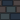
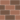

<h1 align=center>Map-Builder for <a href="https://github.com/PyFlat/Plant-The-Bomb">Plant-The-Bomb</a></h1>

# Credits:
- Some textures are from <a href="https://de.freepik.com/">Freepik.com</a>

# Control:
- Comming Soon

# Usage:
- Comming Soon

# Scripting Documentation:
- Comming Soon

# Blocks:
<table>
  <tr>
    <th>Block</th>
    <th>Texture</th>
    <th>Explanation</th>
  </tr>
  <tr>
    <td>Player</td>
    <td></img></td>
    <td>The start position of the player</td>
   </tr>
   <tr>
    <td>Endstone</td>
    <td></img></td>
    <td>Indestructible walls</td>
   </tr>
   <tr>
    <td>Water</td>
    <td></img></td>
    <td>The player can not run over it but the explosion reaches the other side</td>
   </tr>
   <tr>
    <td>Wall</td>
    <td></img></td>
    <td>Can be blown up by the player and can drop items</td>
   </tr>
   <tr>
    <td>+Bomb</td>
    <td></img></td>
    <td>Placeable item through which the player can place multiple bombs simultaneously</td>
   </tr>
   <tr>
    <td>+Range</td>
    <td></img></td>
    <td>Placeable item through which the player has a longer explosion range</td>
   </tr>
   <tr>
    <td>Ghost</td>
    <td></img></td>
    <td>Gives you a random curse</td>
   </tr>
   <tr>
    <td>+Dynamite</td>
    <td></img></td>
    <td>Placeable item through which the player gets a dynamite in the inventory</td>
   </tr>
   <tr>
    <td>+Time-Bomb</td>
    <td></img></td>
    <td>Placeable item through which the player gets a time bomb in the inventory</td>
   </tr>
   <tr>
    <td>+Health</td>
    <td></img></td>
    <td>Placeable item through which the player gets one more life</td>
   </tr>
   <tr>
    <td>Enemy</td>
    <td></img></td>
    <td>Attacks the player, with right-click you can choose how many lives he has and if he does damage</td>
   </tr>
   <tr>
    <td>+Sword</td>
    <td></img></td>
    <td>Bombs and dynamite do more damage to enemies but also to you</td>
   </tr>
   <tr>
    <td>+Atomic Bomb</td>
    <td></img></td>
    <td>Like Dynamite but bigger</td>
   </tr>
   <tr>
    <td>Shield</td>
    <td></img></td>
    <td>Your are immune against normal bombs, dynamite and enemy damage</td>
   </tr>
</table>
